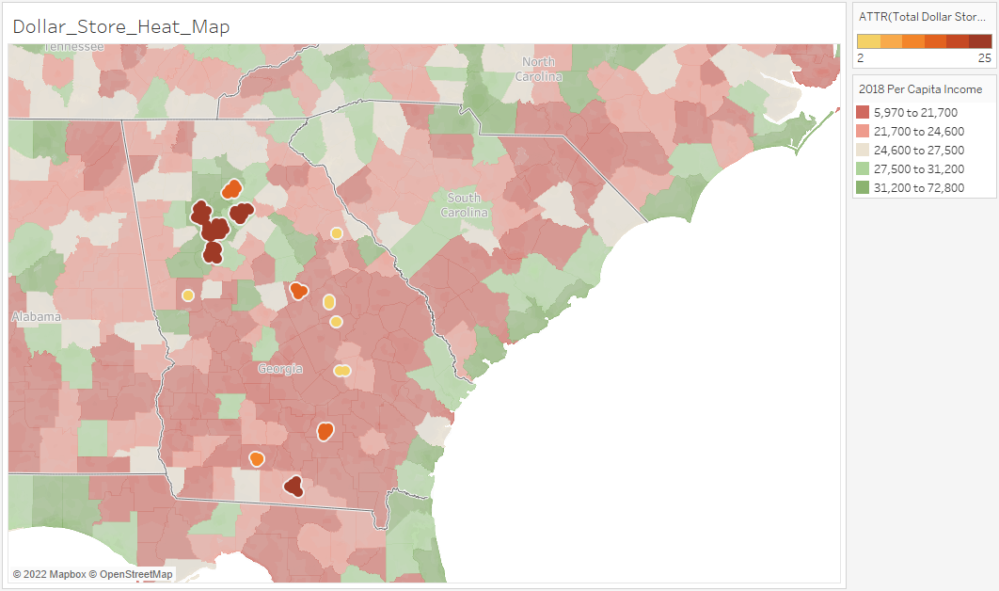

# Project3 - Mapping Food Deserts
### Group Project to Map Food Deserts in Georgia 

## Project Team (The GAP Team)
1. Ellis Purwanto - Data Visualization and Graphs
2. Marc Avoaka - Database Design
3. Shailesh Godkhindi - Data Analysis, Web Programming and Geo Mapping

## Key Deliverables
### Jupyter Notebooks & PowerPoint Presentation
- [County Data_Analysis ](Food_Deserts_Data_County.ipynb)
- [Data Visualization & Graphs](ellisNotebooks/Plotly_Graphs.ipynb)
- [PowerPoint Presentation](ellisCharts/Food_Deserts.pptx)

### Database Components
- [Database_Diagram](SQL/Food_Deserts.png)
- [Database Schema](SQL/Schema.SQL)
- [Database Queries](SQL/queries.sql)

### Web Application + Leaflet
- [Web Application](Webpage/app.py)

## Food Deserts
A Food Desert is an area that has limited access to affordable and nutritious food. Food deserts tend to be inhabited by low-income residents with reduced mobility; this makes them a less attractive market for large supermarket chains. Food deserts lack suppliers of fresh foods, such as meats, fruits, and vegetables. Instead, the available foods are often processed and high in sugar and fats, which are known contributors to the proliferation of obesity in the U.S.

## Development Process
### Beginning the data-gathering process
We found that the Percentage of Free or Reduced Lunches (Percent_FRL) at school is a strong indicator of poverty in an area: https://nces.ed.gov/blogs/nces/post/free-or-reduced-price-lunch-a-proxy-for-poverty

Using this metric and the Per Capita Income data from https://fred.stlouisfed.org/release/tables?eid=266512&rid=175, the team identified 15 counties in GA.

These 15 counties are as follows:
1. Baldwin County
2. Clayton County
3. Cobb County
4. Coffee County
5. Colquitt County
6. DeKalb County
7. Echols County
8. Forsyth County
9. Fulton County
10. Gwinnett County
11. Johnson County
12. Lowndes County
13. Meriwether County
14. Montgomery County
15. Washington County
16. Wilkes County

### Data Analysis Preparation
Once these15 counties were identified the team took the following steps to get all the source data together:
1. List all the 15 counties along with the - Per Capita Income and Percent_FRL
2. Locate the Latitude and Longitude of the County Courthouse for each county. Usually the Courthouse is the centermost point in the county.
3. Create an input file with all this information.

### Getting GeoLocation Info using API
The next step in the process was to use API calls to obtain GeoLocation for Grocery Stores, Dollar Stores and Fast Food Stores
1. We decided use Foursquare Places API to get this info - https://developer.foursquare.com/reference/place-search
2. The locations that were pulled had to be within 6 miles of the County Latitude and Longitude.
3. For Grocery Stores chosen had to be part of a chain as they have the infrastructure and the inventory to service a large population.

### Data Summarization for Analysis
The next step was to get all the data summarized by county. This was done using Panda and Python Code. 

This data was stored in the PostgeSQL database for analysis as well as JSON files.

As can be seen from the data presented below the presence of Grocery Stores is adequate only in certain counties with higher income

### Data Visualization and Graphs
Finally the data from the data frames was saved in files, imported into a separate Jupyter Notebook and using Plotly, following graphs were created:
#### Population and Per-capita Income

#### Store Counts by County

#### Percent FRL and Income Correlation

#### Percent FRL and Grocery Store Distribution

### Heat Maps
The county data was then fed to the Google Maps and Heat Maps showing the distribution of Grocery Stores, Dollar Stores and Fast Food Locations was done.
#### Grocery Store Heat Map

#### Dollar Store Heat Map

#### Fast Food Locations Heat Map

### Web Development and Geo Mapping Using Leaflet
### Web Development
Using Flask, Javascript and HTML the location data for individual stores and fast food locations was displayed on the Web via an interactive map.
[Web Application](Webpage/app.py)

### Location and Geo Mapping using Leaflet
The final step was to display these location using Leaflet and Javascript and the following layered maps were created
#### Georgia Grocery Store Location Map

#### Georgia Dollar Store Location Map

#### Georgia Fast Food Restaurants Location Map

## Conclusion
After analyzing the data and visualizing it the team has arrived at the following conclusion:
Areas with higher levels of poverty are more likely to become Food Deserts. Additionally, poorer counties not only have fewer Grocery stores, but they also have larger numbers of Dollar stores and Fast-Food places proportionate to their population.

