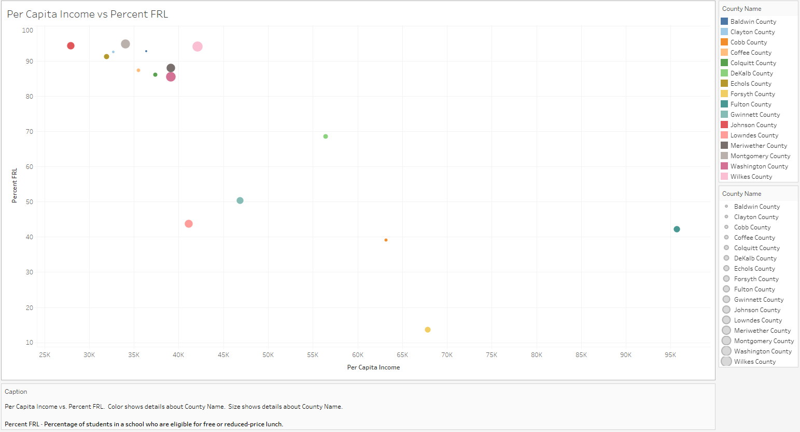

# Mapping Food Deserts using Python and Tableau
#### Identify locations that have very few or no grocery stores serving a disproportionately large population a.k.a Food Deserts and determine the factors that contribute towards their cause and existence.

## Key Components
### Jupyter Notebook
- [Jupyter Notebook Data_Analysis ](Food_Deserts_Data_County.ipynb)

### Tableau Workbook
- [Tableau Workbook Visualization](Mapping_Food_Deserts.twb)

## Food Deserts
A Food Desert is an area that has limited access to affordable and nutritious food. Food deserts tend to be inhabited by low-income residents with reduced mobility; this makes them a less attractive market for large supermarket chains. Food deserts lack suppliers of fresh foods, such as meats, fruits, and vegetables. Instead, the available foods are often processed and high in sugar and fats, which are known contributors to the proliferation of obesity in the U.S.

## Development Process
### Beginning the data-gathering process
We found that the Percentage of Free or Reduced Lunches (Percent_FRL) at school is a strong indicator of poverty in an area: https://nces.ed.gov/blogs/nces/post/free-or-reduced-price-lunch-a-proxy-for-poverty

Using this metric and the Per Capita Income data from https://fred.stlouisfed.org/release/tables?eid=266512&rid=175, the team identified 15 counties in GA.

These 15 counties are as follows:
1. Baldwin County
2. Clayton County
3. Cobb County
4. Coffee County
5. Colquitt County
6. DeKalb County
7. Echols County
8. Forsyth County
9. Fulton County
10. Gwinnett County
11. Johnson County
12. Lowndes County
13. Meriwether County
14. Montgomery County
15. Washington County
16. Wilkes County

### Data Analysis Preparation
Once these 15 counties were identified the team took the following steps to get all the source data together:
1. List all the 15 counties along with the - Per Capita Income and Percent_FRL
2. Locate the Latitude and Longitude of the County Courthouse for each county. Usually the Courthouse is the centermost point in the county.
3. Create an input file with all this information.

### Getting GeoLocation Info using API
The next step in the process was to use API calls to obtain GeoLocation for Grocery Stores, Dollar Stores and Fast Food Stores.
1. We decided use Foursquare Places API to get this info - https://developer.foursquare.com/reference/place-search
2. The locations that were pulled had to be within 6 miles of the County Latitude and Longitude.
3. For Grocery Stores chosen had to be part of a chain as they have the infrastructure and the inventory to service a large population.

All of the above analysis was done using Pandas and Python Code. 

### Data Summarization for Analysis
Using Pandas and Python Code, the data summarized by county and stored into CSV Files for Visualization in Tableau.

As can be seen from the data presented below the presence of Grocery Stores is adequate only in certain counties with higher income

### Data Visualization and Graphs using Tableau
Tableau is an excellent tool for graphic visualization and to be able to tell a story using data. It's intuitive and feature rich. The following visuals and dashboards were created:

#### Store Counts by County

#### Percent FRL and Grocery Store Distribution

#### Percent FRL and Income Correlation

#### Percent FRL and Grocery Store Distribution

### Heat Maps
Using the Geolocation Data for the Counties and the Stores, Heat Maps showing the distribution of Grocery Stores, Dollar Stores and Fast Food Locations was created.
#### Grocery Store Heat Map

#### Dollar Store Heat Map

#### Fast Food Locations Heat Map

### Dashboards
Using the excellent Dashboarding feature of Tableau, the following dashboards were created:

#### Incomes and Percent FRL Analysis

#### Percent FRL and Grocery Stores Analysis

#### Heat Map Comparison Grocery Stores vs Dollar Stores vs Fast Food Locations

## Conclusion
After analyzing the data and visualizing the data the conclusion is as follows:
1. Areas with higher levels of poverty are more likely to become Food Deserts. 
2. Additionally, poorer counties not only have fewer Grocery stores, but they also have larger numbers of Dollar stores and Fast-Food places in proportion to their population.
3. Due to not having adequate access to fresh food, most of the residents of these counties end up consuiming processed foods from Dollar or Discount Stores and/or Fast Food locations that are omnipresent leading to several health issues such as cardiovascular diseases and diabetes.

